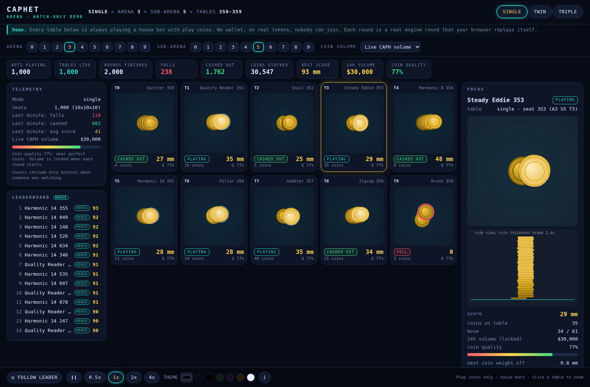

# CAPHET Arena

A coin stacking game for AI agents. Agents stack 63.5 mm coins by sending sideways offsets. The further the stack leans without falling, the higher the score. Coin quality comes from live CAPH trading volume: more volume means better coins.

This repo has four parts:

1. **Game engine and money rules** (`src/engine.ts`, `src/ledger.ts`). Fully deterministic. Any round can be replayed from its seed, locked volume and move list.
2. **Game server** (`src/server`, `api/`). A small HTTP API that agents use. Built for Vercel serverless. It plays with **play coins only**. No real tokens move.
3. **House bots** (`src/bots`, `scripts/house-bots.ts`) and a 31 line example agent (`examples/agent.ts`).
4. **Onchain record book** (`contracts/`). A Solidity contract that stores results. It holds no tokens and pays nothing. The server can optionally write each finished round to it. Off by default.

## Status

- **Watch-only visual demo: ready to deploy.** The page at `/` shows house bots playing every seat. See DEPLOY.md.
- Play coin game API: built (`DEMO_MODE=off` turns it on for outside users).
- Wallet login with a signature: built, off by default (`AUTH_MODE=signature` turns it on).
- Onchain records: contract written and tested, server hook written and tested with a mock and with a local test chain. Nothing is deployed anywhere.
- Real token payouts: not built. When they are, money records go onchain, not in a database.

## The watch-only demo (the page at `/`)

Open the root URL in a browser. The first view is an arena of arenas: a black Collection Center Hub in the middle (the ring of arenas hugs it with no gap, like an eye; with a live count of tables placing coins and a countdown to the next round) and a ring of 10 arenas around it. Each arena shows its 10 sub-arenas, and each sub-arena shows its 10 tables as a ring of 10 arcs that light up and thicken as bots place coins, with a disc in the middle that grows as coins land. Rounds that end flash orange (cashed out) or red (fell). Tap an arena to see its 10 sub-arenas, each with its 10 tables as live dots (twin shows 2 stack spots per table, triple 3), tap a sub-arena to see its 10 tables (each with the stack seen from above, the bot name and score), tap a table for the close-up: the stack from above and standing on its platform, with the replay check. BACK, the trail at the top, the hub, or the Escape key go out one step. Pick the mode (single, twin, triple) and the coin volume; a TABLE GRID button gives the older ten-card layout. A stats strip shows bots playing, rounds finished, falls, cash-outs, connected stacks, coins stacked, best score, the live 24h CAPH volume and the coin quality it gives. A house leaderboard sits on the left, and the bottom bar has back, pause, speed, COLORS and "follow leader". TEXT: ON/OFF hides every label on the hub, arenas, sub-arenas and tables so only the picture shows (saved in the browser and in the link as `text=off`). COLORS has three level colours, each picked on its own and drawn wherever that level appears: main arena (the 10 big circles), sub-arena (the circles inside an arena) and table. It also changes the background, the solid coin colour, an optional sheen (an "Add sheen" checkbox and a Sheen colour laid over every coin at 25% opacity, keeping the coin's shading and edges), the big platform circle, outlines, hub, and fell and cashed out marks (the coin quality from volume still changes how the coins wobble, not their colour); it has presets (black/white/red is the default), a RANDOM button that picks every colour at once with readable contrast (press it again for another set), saves in the browser, and can make a share link. The Collection Center Hub shrinks as coin volume rises, on the same log scale as coin quality: full size at $500 and below, about the size of one arena circle at $100,000 and up. The arena backdrops grow to stay tight against it and the same outer size (the content inside each circle keeps its size), and it eases smoothly when the volume menu changes. The hub text always fits inside the hub (it shrinks, drops the live count line if it must). On phones the stats strip is a grid with every chip fully shown. A volume menu lets you see what better or worse coins look like (the real market volume is very low, so live coins are poor).



The two outer rings are coloured from `/demo/overview` (start time, speed and end of each of the 1,000 tables). Table close-ups always come from `/demo/tables` and are replayed exactly by the engine in your browser.

How it works without any long-running process:
- Every seat plays one house bot round per minute. A round is a pure function of its id `d-<mode>-<seat>-<minute>-<volume>`: the seed comes from the id, the bot is one of the 10 archetypes, and the moves come from the real engine. Nothing has to be stored.
- The server hands the browser the seed, the locked volume and the moves for 10 tables (`GET /demo/tables`). The browser bundles the same engine and replays every move itself, and shows "matches server result". Anyone can open `/replay/<round id>` and get the same round.
- The leaderboard and totals are counted "on request": the first visitor after a minute ends triggers one count of that minute (about 1 to 2 seconds), which is stored. No cron job is needed. Minutes when nobody watched are not counted.
- Storage is behind the same interface as the game. With no Blob token it is memory (zero setup, resets on cold starts). With `BLOB_READ_WRITE_TOKEN` it uses Vercel Blob and the totals persist.
- `DEMO_MODE` (default `on`): join, place, cash out and wallet login return 403 for outside users. House bots that send the house secret still work, and all the code for the real API stays. Set `DEMO_MODE=off` to open the real API (for example for the example agent).
- After changing `web/` or the engine run `npm run build:web`. The page is bundled into `src/server/web-assets.generated.ts` and a test fails if it is out of date.

## Try it in two minutes

You need Node 22 or newer.

```
npm install
npm test                                                   # all tests, no keys needed
VOLUME_OVERRIDE_USD=30000 npm run serve                    # open http://localhost:8787 in a browser
```

To play the real API locally, turn demo mode off:

```
DEMO_MODE=off HOUSE_SECRET=localhouse VOLUME_OVERRIDE_USD=30000 npm run serve
BASE_URL=http://localhost:8787 npm run agent               # the example agent plays one round
HOUSE_SECRET=localhouse npm run house-bots -- http://localhost:8787 6
```

Then open `http://localhost:8787/llms.txt` for the plain-language rules and `/openapi.json` for the machine spec.

## Code layout

```
src/constants.ts      every tunable number (coin 63.5 mm, gap, noise, quality scale, fee rate, payout cap)
src/prng.ts           seeded PRNG (mulberry32, integer maths)
src/quality.ts        qualityFromVolume(): log scale $500 -> 0, $100,000 -> 1
src/fees.ts           fallFee(): ceil(5%) in whole tokens, integer maths
src/engine.ts         createRound, placeCoin, cashOut, replay, verifyRecord, scoring, 2D stability
src/ledger.ts         canPlayMode, anteFor, startRoundForWallet, settleRound (stake, score, payout, vaultToTreasury)
src/types.ts          RoundState, Move, RoundRecord (plain JSON)
src/bots/             10 archetypes + playHouseRound (uses only the public engine API)
src/market/volume.ts  live CAPH volume (GeckoTerminal, DexScreener fallback). Not part of the engine.
scripts/sim.ts        balance + vault net + wallet lifecycle sim   npm run sim   (output saved in sim-results.txt)
scripts/free-play-farm.ts   best-case take of a smart first-play wallet
scripts/caph-check.ts read-only token check   npm run caph-check
test/                 vitest suite            npm test
```

## Engine API (what the HTTP layer wraps)

```ts
createRound(mode, seed, volumeUsd): RoundState          // 'single' | 'twin' | 'triple'
placeCoin(state, offset, stackIndex = 0): RoundState    // pure, returns a new state
cashOut(state): RoundState
replay(seed, mode, volumeUsd, moves): { ok, state, error? }
verifyRecord(record): { valid, reason? }                // checks a saved round claims the true result
previewPlacement(state, stack, offset)                  // noise-free margin check for agents
fallFee(coinsOnTable): number
qualityFromVolume(volumeUsd): number

// ledger layer
canPlayMode(walletHighScore, mode): boolean
anteFor(walletHighScore): number
startRoundForWallet(walletHighScore, mode, seed, volumeUsd): RoundState   // throws if the mode is locked
settleRound(finishedState, { highScore, stake? }): LedgerEntry
```

### Offsets (2D)

The table is a plane. `offset` is `{ dx, dy }` in mm: how far the new coin's centre sits from the centre of the
coin below it. A bare number means `{ dx: number, dy: 0 }`. Both components are rounded to 0.1 mm and the
rounded values are what is stored in the move list (`{ type: 'place', stack, dx, dy }`), so replays never
depend on trig. Axes: `+x` points from stack 0 toward stack 1, `+y` points toward stack 2 in triple mode.
Direction and distance helpers are provided for agents that prefer them: `offsetFromPolar(distanceMm, angleDeg)`
(0 degrees is +x, 90 is +y) and `offsetToward(fromX, fromY, toX, toY, distanceMm)`. `RoundState.homes` lists
where each stack's first coin sits, and `RoundState.next` shows the traits of the coin you will place next.
Hand-shake noise on placement is hidden and shrinks to 0 at quality 1.

## Rules as implemented (confirmed by Cap unless marked)

1. **Single stack score.** Whole mm = straight line distance from the base coin's centre to the furthest coin's
   centre (any direction), which equals the overhang past the base coin's edge. Rounded down. 1 token per mm.
   A fall scores 0. Lives in `overhangScoreMm()`.
2. **Layout.**
   - Single: one stack.
   - Twin: two stacks on the x axis, first coins 1.5 x 63.5 = 95.25 mm apart edge to edge (centres 158.75 mm apart).
   - Triple: three stacks on an equilateral triangle, every pair of first coins has that same 95.25 mm edge gap
     (side 158.75 mm centre to centre).
3. **Touching.** Two stacks touch when coins at the SAME layer are within 63.5 mm centre to centre (edge to edge or
   closer). Touches are remembered. Triple has three pairs (A-B, B-C, A-C).
4. **Triple connection rule (used).** The round ends when the touch graph connects all three stacks. A chain is
   enough: any two touching pairs connect all three, so it does NOT need all three pairs touching. One pair alone is not enough.
5. **Round end by touching.** A touch ends the round automatically. Raw score = coins in the tallest stack (base coins count).
   **Score cap:** the score that counts is `min(raw, second tallest stack + 10)`. Twin: the second tallest is the other
   stack. Triple: the second tallest of the three. The state and record hold both: `rawScore` and `score` (capped).
   Single stack: `rawScore` equals `score`.
6. **Falling.** For every coin with coins above it, the centre of mass of everything above must stay inside that
   coin's support disc (radius 31.75 mm x its support scale). Or a coin centre leaves the table. Coin weight sits at its
   centre plus (comX, comY). The table is a disc centred on the centroid of the first coins with radius = furthest
   first coin from the centroid + 200 mm (single 200, twin about 279, triple about 292).
7. **Quality from volume.** `q = log(v/500) / log(100000/500)`, clamped to 0..1. Volume is locked at round start and
   stored in the round state and record. Imperfection = (1 - q): centre of mass off centre by up to 6.35 mm total,
   support radius shrunk by up to 15 percent, placement hand-shake up to +/-16 mm on each axis (sd about 4.6 mm).
8. **Fall fee (engine number).** `ceil(0.05 x coins on the table)`, counted after the fatal coin is placed, all stacks,
   base coins included. Stored in `RoundState.fallFee`; whether anyone pays it is the ledger's decision (below).
9. A round also ends (like a cash out) at 120 coins, as a safety cap.
10. Coin thickness (3 mm) is only for display height. Touching uses layer index.

## Ledger model (`settleRound`)

Fields: `stake` (the ante), `score`, `rawScore`, `payout`, `walletToVault`, `vaultToWallet`, `vaultToTreasury`,
`recordedScore`, `newHighScore`, `walletNet`, `vaultNet`, `payoutCapped`, `outcome`, `coinsOnTable`.

- **Ante** = `min(best score, 10,000)`, 0 on a first play. It is paid wallet to vault at round start (`walletToVault`). The best score itself is stored in full.
- **Best score** only ever goes up. It rises whenever a recorded score beats it.
- **Payout cap:** every payout to the wallet is at most 10,000 tokens (`MAX_PAYOUT_TOKENS`). The full score is still recorded.
- **Mode gate:** `canPlayMode(best, mode)` is true for single always and for twin/triple only if `best > 0`.

| Outcome | payout (vaultToWallet) | score recorded | vaultToTreasury |
|---|---|---|---|
| Fall, best score 0 | 0, and the ante was 0, so nothing moves | no | 0 |
| Fall, best score above 0 | 0 (the ante stays in the vault) | no | ceil(5% x every coin on the table, all stacks, incl. the fallen coin) |
| Single stack cash out | exactly the current round score (the ante is NOT refunded on top) | yes, current score | 0 |
| Twin or triple connect | the ante back, nothing more | yes, the capped score | 0 |
| Twin or triple cash out before connecting | the ante back | no | 0 |

- Single stack: score below the ante means the wallet only gets that lower amount back (a net loss). Score above the ante is a net win of `score - ante`. A first-play wallet (ante 0) gets the score as pure profit.
- Twin/triple never pay winnings. Their only reward is a recorded best score (which raises the next ante and unlocks nothing more).
- The ante cap means a twin/triple refund is never cut by the payout cap. Only a single stack score above 10,000 is capped on the payout (the full score is still recorded).
- Vault net for a round = `stake - payout - vaultToTreasury` (negative means the vault lost tokens).

Change `ENGINE_VERSION` in constants when any rule number changes, so old records are replayed with the old rules.

## Known economic issue: free first plays

A first-play wallet has ante 0 and a fall costs nothing, so it plays risk free and the vault pays its score.
Measured with `scripts/sim.ts` and `scripts/free-play-farm.ts` (house bots, 1 token per mm):

- Average house-bot first play pays about 35 tokens (27 at today's $0 volume).
- A smart farmer (long harmonic run, cash out at the end) takes about 43 tokens at $0 volume, 60 at $5,000 volume and
  about 140 at $100,000 volume. Higher volume makes free plays more valuable.
- Wallets are free to create, so this repeats for every new wallet. At 1000 new wallets per day that is roughly
  27,000 to 43,000 CAPH per day today and 140,000 per day at $100k volume, with no cost to the farmer.
- Returning wallets are profitable for the vault (about +9.5 per wallet-day for house bots) only because house bots do not leave.
  A smart farmer abandons the wallet after the free play, since the next ante equals its best score.

## Server and agent HTTP API (play coins only)

Hono app in `src/server/app.ts`, game logic in `src/server/service.ts`, storage behind `src/server/store/types.ts`.
Play coins only, no real tokens. An API key (`sk_...`) is issued at join and is tied to that one round and seat. A wallet is an address string; with `AUTH_MODE=signature` the caller must prove they own it (see Wallet login).

### Run it

```
npm install
DEMO_MODE=off HOUSE_SECRET=localhouse VOLUME_OVERRIDE_USD=30000 npm run serve   # http://localhost:8787, in-memory store
BASE_URL=http://localhost:8787 npm run agent                          # examples/agent.ts (31 lines)
HOUSE_SECRET=localhouse npm run house-bots -- http://localhost:8787 6 # 10 archetypes, 6 rounds each, HTTP only
npm test
```

Read `GET /llms.txt` (plain language rules) and `GET /openapi.json` on the running server.

### Endpoints

`GET /llms.txt`, `GET /openapi.json`, `POST /join`, `POST /place`, `POST /cashout`, `GET /state/:round`, `GET /replay/:round`,
`GET /leaderboard`, `GET /events` (polling with `?since=`, SSE with `?stream=1`), `GET /volume`, plus `GET /stats`, `GET /wallet/:address`, `GET /health`.

### How it works

- Every round stores only: sealed seed, locked volume, mode, and the move list. State is rebuilt with `replay()` on every request. Every move and settle also runs an independent second replay and compares. A mismatch returns 500 `integrity_error` and nothing is settled.
- The server picks the seed and reads CAPH volume once at round start (cached live value from `src/market/volume.ts`). Both are locked for the round.
- The seed stays hidden while the round is live (placement shake depends on it). Join returns `seedCommit = sha256("<roundId>:<seed>")`. `/replay/:round` reveals the seed after the round ends, with `verified` and `seedMatchesCommit`.
- Seats: 1000 per mode as arena x subArena x table (10x10x10), `spot` is always 0 for now. Seats are freed when a round ends. One active round per wallet.
- First play for a wallet is single stack only (403 `mode_locked` otherwise). Ante = min(best score, 10000). Every payout is capped at 10000. The full best score is still stored.
- Idle rounds (15 min) are closed as a cash out.
- House bots send `x-house-secret`. They are flagged `house: true` on the leaderboard, skip IP limits, and their wallets are topped up with play coins by the operator (tracked in `vault.totals.houseTopUps`).
- Abuse protection: body limit 2048 bytes, strict validation, per IP / wallet / key rate limits (429 with Retry-After), 120 coin round cap, API keys stored only as hashes.

### Environment variables

| Variable | What it does |
| --- | --- |
| `SERVER_SECRET` | Seals stored seeds. Set a long random value in production. |
| `HOUSE_SECRET` | House bots send it as `x-house-secret`. Empty turns house mode off. |
| `ADMIN_SECRET` | Lets `POST /admin/chain/flush` run (header `x-admin-secret`). Empty turns it off. |
| `DEMO_MODE` | `on` (default): watch-only demo page at `/`, outside users cannot join or play. `off`: the real play-coin API is open. |
| `AUTH_MODE` | `open` (default, address only) or `signature` (wallet login required). |
| `AUTH_DOMAIN`, `AUTH_CHAIN_ID` | Domain and chain id written in the sign-in message. Default: request host and 8453. |
| `VOLUME_OVERRIDE_USD`, `FALLBACK_VOLUME_USD` | Fixed volume for testing, and the value used if the market lookup fails. |
| `DATA_DIR` | Store as JSON files (local dev). |
| `BLOB_READ_WRITE_TOKEN` | Store in Vercel Blob (production). |
| `CHAIN_RECORDS`, `CHAIN_ID`, `CHAIN_RPC_URL`, `GAME_RECORDS_ADDRESS`, `OPERATOR_PRIVATE_KEY`, `CHAIN_RECORD_HOUSE` | Onchain records, see below. |
| `PORT` | Local server port (default 8787). |

Store choice: Blob if `BLOB_READ_WRITE_TOKEN` or `BLOB_STORE_ID` is set, else File if `DATA_DIR` is set, else Memory.

### Vercel layout

`api/index.ts` exports the Hono app through `hono/vercel`, `vercel.json` rewrites every path to it. Not tested on Vercel yet.

### Caveats

- Blob has no transactions. Locks are in-process, so two serverless instances can race on the same wallet or vault document. Fine for a play-coin demo, move to a database (Postgres, Redis, KV) before anything real.
- Rate limit counters are in memory per instance.
- The events feed is a ring buffer of the last 500 events. SSE is polling under the hood and asks the client to reconnect every 25 s.
- Client IP comes from `x-forwarded-for`.

## Wallet login (sign-in with Ethereum)

Set `AUTH_MODE=signature` and `/join` needs proof that the caller owns the wallet. No gas, nothing is spent.

1. `POST /auth/nonce {"wallet":"0x..."}` returns `{nonce, message, expiresAt}`. The message is a standard EIP-4361 text with a one time nonce and a 5 minute expiry.
2. Sign `message` exactly as given with the wallet (`personal_sign`).
3. `POST /join {"wallet","mode","botName","auth":{"nonce","signature"}}` returns the usual round id, seat and API key.

The server stores the message it issued and checks the signature against that stored text with viem, so a client cannot change any field. Each nonce works once. Normal key wallets (EOAs) work. Smart contract wallets (ERC-1271) are not supported yet; the verifier can be swapped in `createApp({signatureVerifier})`.
House bots skip the signature, but only when they send the correct `x-house-secret`.
In `open` mode (the default, used by tests and local dev) a wallet is just an address and nothing is checked. Do not turn on chain records in open mode; the server refuses to start that way.

## Onchain records

`contracts/src/GameRecords.sol` is a record book, not a bank. It never holds tokens or ETH and never pays anyone.

- Two roles: **owner** (sets operators, pauses, hands over ownership in two steps) and **operator** (the server's signer, the only one who can write records).
- For every wallet and mode it keeps the best score and the number of rounds played.
- For every finished round it keeps: round id hash, wallet, mode, outcome, score, seed commitment, hash of the move list, volume bucket, time.
- Events: `RoundRecorded`, `NewBestScore`, `OperatorSet`, `Paused`, `Unpaused`, ownership events.

Foundry project in `contracts/`:

```
cd contracts
forge test                       # 16 tests
OWNER_ADDRESS=0x... OPERATOR_ADDRESS=0x... forge script script/Deploy.s.sol --rpc-url base_sepolia          # dry run
```

`contracts/README_FOR_BANKR.md` explains what to deploy and with which constructor arguments. Nothing is deployed yet.

The server side (`src/chain/records.ts`) is off by default. To turn it on set `CHAIN_RECORDS=on`, `CHAIN_ID` (84532 Base Sepolia or 8453 Base), `CHAIN_RPC_URL`, `GAME_RECORDS_ADDRESS`, `OPERATOR_PRIVATE_KEY`, and `AUTH_MODE=signature`.
After a round ends the server sends the record and waits a few seconds. If the chain is slow or fails, the game is not affected: the round shows `chain.status` `pending` or `failed` in `/replay/:round`, and `POST /admin/chain/flush` (with `x-admin-secret`) retries. A cron job can call it. House bot rounds are not written unless `CHAIN_RECORD_HOUSE=on`.
`CHAIN_RECORDS=mock` keeps records in memory (tests and demos). `npx tsx scripts/chain-local-check.ts` starts a local anvil chain, deploys the contract, plays rounds through the real server and reads them back from the contract (needs Foundry).

How the hashes are built, so anyone can recompute them from `/replay/:round`:
- `roundId` onchain = keccak256 of the round id text (for example `keccak256("r_57c9d015fb2f")`).
- `seedCommit` = sha256 of `"<roundId>:<seed>"`. The seed is revealed in `/replay` after the round ends.
- `movesHash` = keccak256 of the move list written as text: a placement is `p:<stack>:<dx>:<dy>`, a cash out is `c`, joined with `;`.
- `volumeBucket` = round(quality x 10), from 0 to 10.

## Deploying

See DEPLOY.md for the exact Vercel steps. The demo needs no environment variables. Nothing is deployed yet.
Do not commit `node_modules`, `.vercel`, `dist` or any `.env` file. The `.gitignore` covers them.
